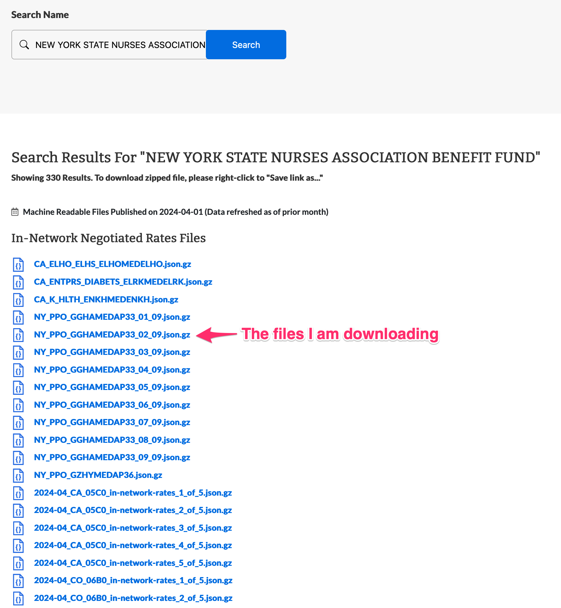

# Serif Take Home Challenge

https://github.com/serif-health/takehome

## Introduction

Deliverable

You should send us a link to a public repository or zip file that contains at miminum:

    The script or code used to parse the file and produce output.
    The setup or packaging file(s) required to bootstrap and execute your solution code
    The output URL list.
    A README file, explaining your solution, how long it took you to write, how long it took to run, and the tradeoffs you made along the way.

## Approach

My initial thought is to output the URLs listed in the file as quickly as possible. No optimization, no processing, just output the URLs. This will give me a baseline for how long it takes to read the file and output the URLs.

### Challenges

* Not only is the file large, but after `head -n 5 data/2024-04-01_anthem_index.json` I realized that the entire file is 1, single, 28GB JSON message! Hilarious abuse of JSON. So we are going to have to stream parse parts of this file.

* The files are associated to plans and we only want the files associated to the "Anthem PPO network in New York state". The naming looks inconsistent, so I did the simplest thing and just looked for "NY" and "PPO" in the plan name, printed out 100 of them, and manually checked them against the [Anthem EIN lookup](https://www.anthem.com/machine-readable-file/search/).

* PPO networks seem to be negotiated arbitrarily across the country. For example, the `NEW YORK STATE NURSES ASSOCIATION BENEFIT FUND` has in-network negotiated rate files that cover NY, CA, CO, CT, GA, etc. All of the files appear to have `NY` in the name so as a simple heuristic I will use that to filter the files. This is a tradeoff I am making to simplify the problem, and likely wouldn't hold true in a real-world scenario.



* The PPO files seem to be hosted directly on s3 while the other files are hosted on a different domain. However, the s3 files are not consistently named, i.e. the `NY_PPO_GGHAMEDAP33_04_09.json.gz` file shown in the EIN lookup is named `NY_GGHAMEDAP33_04_09.json.gz` in the index file. If we wanted to be more strict about which files to return, we may be able to use the s3 domain as a filter.

## Solution

I was planning to case a wide net and include all the files relevant to the NY PPO plans, but the hint `Is Highmark the same as Anthem?` make me think that I should be more strict about the files I return. Anthem and Highmark are affiliated via [BCBSA](https://en.wikipedia.org/wiki/Blue_Cross_Blue_Shield_Association), but Anthem appears to be an exclusive subset distinct from Highmark. I will only return files that are explicitly associated with Anthem PPO plans in NY, stored on the s3 domain. I don't feel great about the s3 domain filter as a long-term solution, but it is the best heuristic I can come up with given the constraints. While it may not be useful next month (they may change how they host the files), I think it is useful enough to generate a list of URLs for this month.

You can read my list of URLs [here](./data/solution.txt).

### Running the Code

#### Pre-requisites (macOS)

* You will need to download the data file from the Anthem website and place it in the `data/` directory. The file is too large to include in the repository.

```bash
curl -o data/2024-04-01_anthem_index.json.gz https://antm-pt-prod-dataz-nogbd-nophi-us-east1.s3.amazonaws.com/anthem/2024-04-01_anthem_index.json.gz
```

```bash

* If you already have go installed, you can run the code with the following command:

```bash
go run main.go
```

If you don't want to install go, you can use the Dockerfile to run the code.

* GNU Make (optional) - `brew install make`

* Docker (optional) - If you are using Docker, you can run the code with the following command:

```bash
make run
```

### Improvements

* This could be make concurrent by adding a goroutine to process each message. The runtime of this script was ~140s on my machine. I think you could reduce this to ~5s with some buffer optimization and goroutines. We could proabably forgo the bufio package altogether in favor of `os.Read()` directly if performace was the primary concern.

* All of this process is using metadata from the JSON file. There is only so much that can be done with the metadata. The contents of the files could be processed to extract more information. For example, the naming filters we are doing are very fragile and probably prone to error. If we could extract the contents of the files and use that to filter, we could be more confident in the results.

* I am a huge fan of golang CLIs, so I would probably make this a CLI tool with flags for the filters. This would make it easier to use and more flexible to run across different datasets without changing the code.

* The `main()` function is a bit long and could be broken up into smaller functions. This would make the code easier to read and maintain.

## Resources

<details>
  <summary>Code to print 25 plan names to the console.</summary>

```golang
package main

import (
	"bufio"
	"encoding/json"
	"fmt"
	"io"
	"log"
	"os"
	"regexp"
)

type FileLocation struct {
	Description string `json:"description"`
	Location    string `json:"location"`
}

type ReportingPlan struct {
	PlanName       string `json:"plan_name"`
	PlanIdType     string `json:"plan_id_type"`
	PlanId         string `json:"plan_id"`
	PlanMarketType string `json:"plan_market_type"`
}

type ReportingStructure struct {
	ReportingPlans    []ReportingPlan `json:"reporting_plans"`
	InNetworkFiles    []FileLocation  `json:"in_network_files"`
	AllowedAmountFile FileLocation    `json:"allowed_amount_file"`
}

type Record map[string]interface{}

func main() {
	filename := "data/2024-04-01_anthem_index.json"
	nyPattern := regexp.MustCompile("\\sNY\\s")
	ppoPattern := regexp.MustCompile("\\sPPO\\s")

	file, err := os.Open(filename)
	if err != nil {
		fmt.Println("Error opening file:", err)
		return
	}
	defer file.Close()

	reader := bufio.NewReader(file)
	for {
		var record ReportingStructure
		// Each line is a separate JSON object within the larger JSON object
		line, err := reader.ReadBytes(byte('\n'))

		if err == io.EOF {
			break
		}
		if err != nil {
			log.Fatal(err)
		}
		// Remove the trailing newline and comma from the line
		err = json.Unmarshal(line[:len(line)-2], &record)
		if err != nil {
			continue
		}
		n := 0
		for _, plan := range record.ReportingPlans {
			hasNy := nyPattern.MatchString(plan.PlanName)
			hasPpo := ppoPattern.MatchString(plan.PlanName)
			if hasNy && hasPpo {
				fmt.Println(plan.PlanName)
				n++
				if n > 25 {
					break
				}
			}
		}
	}
}
```

</details>